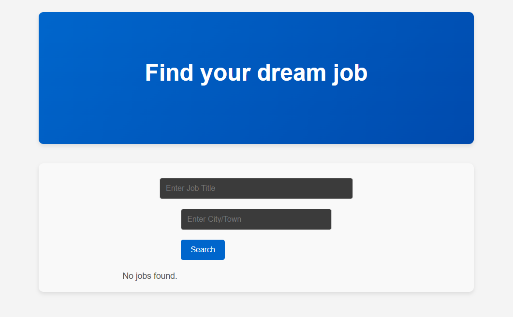
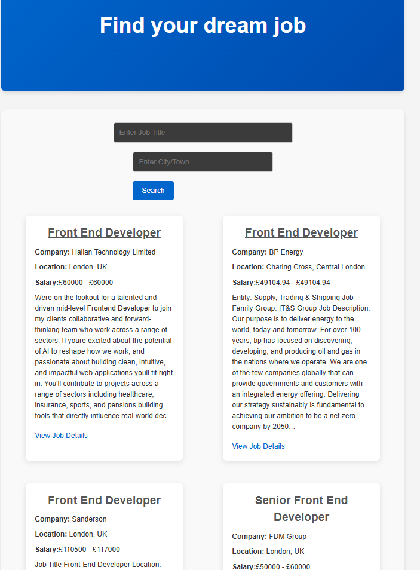

# 💼 Job Board

A React-based job search application that lets users search for jobs by title and city/town. The app fetches live job data from the [Adzuna Jobs API](https://api.adzuna.com), displaying results dynamically in a clean and responsive UI.

🔗 [Live Demo](https://adeelh12.github.io/job-board/)  
📂 [GitHub Repo](https://github.com/AdeelH12/Job-Board)

---

## ✨ Features

- 🔎 **Search Jobs**: Enter job title and location to find opportunities.  
- 📋 **Job Listings**: Results displayed with job title, company, location, and description.  
- 🌍 **API Integration**: Live data fetched from Adzuna Jobs API.  
- 📱 **Responsive Layout**: Works seamlessly across devices.  
- ♻️ **Reusable Components**: Clean React component structure.  

---

## 🛠️ Tech Stack

- **Frontend**: React.js  
- **Hooks**: useState, useEffect  
- **Styling**: CSS3
- **API**: Adzuna Jobs API  

---
## 📸 Screenshots

### 🔍 Search Form


### 📋 Job Results


---

## 🔮 Future Improvements
- Add pagination for large result sets.
- Save favourite jobs to localStorage or a database.
- Implement filters (salary, job type, remote/hybrid).
- Add loading states and skeleton screens for better UX.
- Improve styling with a modern UI framework (Tailwind / Material UI).

## 📚 What I Learned

- Consuming and displaying data from a third-party API (Adzuna).
- Managing controlled inputs in React for dynamic search forms.
- Rendering results conditionally and handling loading/error states.
- Designing a scalable component structure.
  
---

## 🚀 Getting Started

Clone the repository and install dependencies:

```bash
git clone https://github.com/AdeelH12/Job-Board.git
cd Job-Board
npm install
npm start
